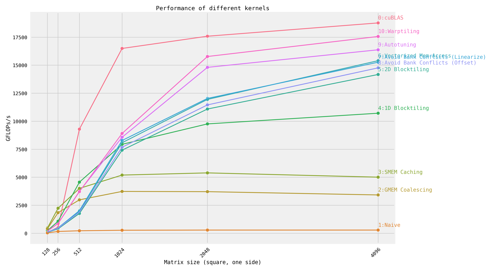

# Fast CUDA SGEMM from Scratch

Step-by-step optimization of matrix multiplication, implemented in CUDA.
For an explanation of each kernel, see [siboehm.com/CUDA-MMM](https://siboehm.com/articles/22/CUDA-MMM).

## Overview

Running the kernels on a NVIDIA A6000 (Ampere):



GFLOPs at matrix size 4096x4096:
<!-- benchmark_results -->
| Kernel                              |   GFLOPs/s | Performance relative to cuBLAS   |
|:------------------------------------|-----------:|:---------------------------------|
| 1: Naive                            |      291.7 | 1.6%                             |
| 2: GMEM Coalescing                  |     3411.6 | 18.3%                            |
| 3: SMEM Caching                     |     5015   | 26.9%                            |
| 4: 1D Blocktiling                   |    10710.3 | 57.5%                            |
| 5: 2D Blocktiling                   |    14175.3 | 76.1%                            |
| 8: Avoid Bank Conflicts (Offset)    |    14758.5 | 79.2%                            |
| 7: Avoid Bank Conflicts (Linearize) |    15270.9 | 81.9%                            |
| 6: Vectorized Mem Access            |    15395   | 82.6%                            |
| 9: Autotuning                       |    15906.1 | 85.4%                            |
| 10: Warptiling                      |    16039.6 | 86.1%                            |
| 0: cuBLAS                           |    18636   | 100.0%                           |
<!-- benchmark_results -->

## Setup

1. Install dependencies: CUDA toolkit 12, Python (+ Seaborn), CMake, Ninja. See [environment.yml](environment.yml).
1. Configure NVCC compilation parameters. Look up your GPUs compute
   capability [here](https://developer.nvidia.com/cuda-gpus). Then configure the `CMakeLists.txt` and change:
    ```cmake
    set(CUDA_COMPUTE_CAPABILITY 80)
    ```
1. Build: `mkdir build && cd build && cmake .. && cmake --build .`
1. Run one of the kernels: `DEVICE=<device_id> ./sgemm <kernel number>`
1. Profiling via [NVIDIA Nsight Compute](https://developer.nvidia.com/nsight-compute) (ncu): `make profile KERNEL=<kernel number>`

Credit goes to [wangzyon/NVIDIA_SGEMM_PRACTICE](https://github.com/wangzyon/NVIDIA_SGEMM_PRACTICE) for the benchmarking setup.
